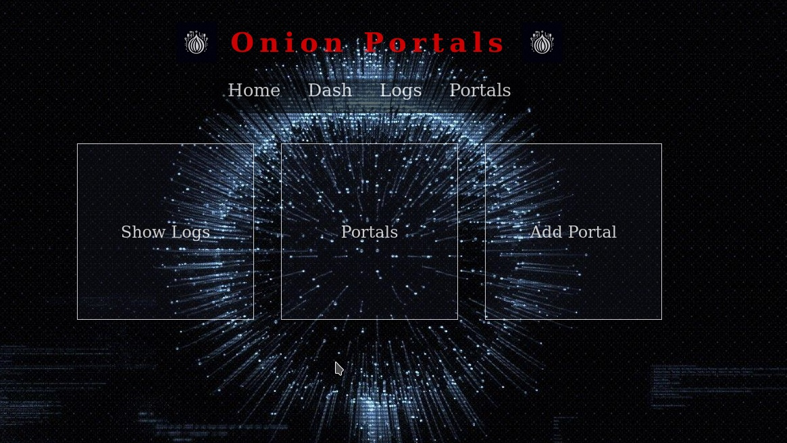
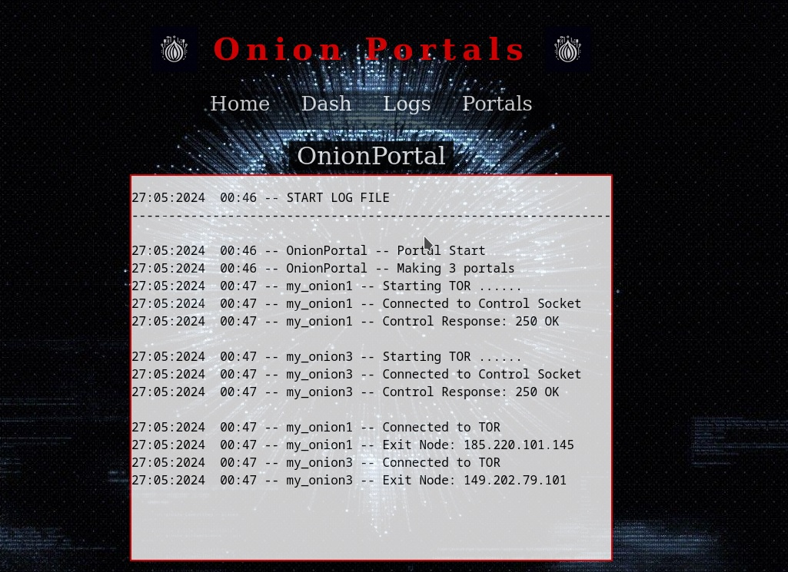
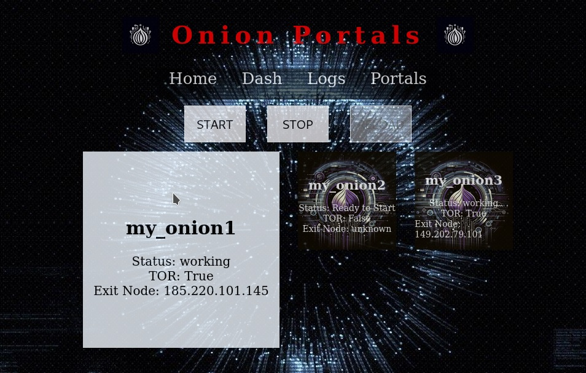
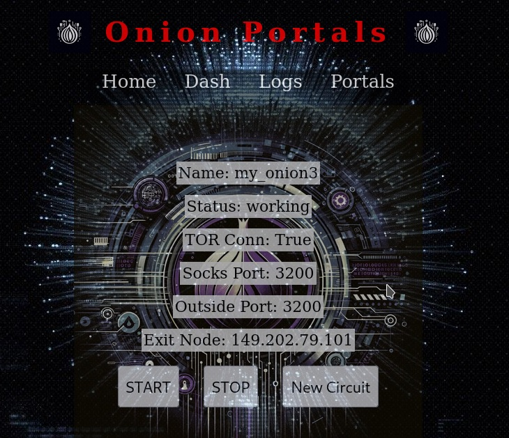

<!DOCTYPE html>
<html lang="en">
<head>
    <meta charset="UTF-8">
    <meta name="viewport" content="width=device-width, initial-scale=1.0">
</head>
<body>
    
<h1>Onion Portal</h1>

    

        
    

     
    

        
The Docker image contains multiple TOR proxies, making it highly configurable and flexible. It includes an HTTP API built with Flask. The image and container creation, along with the entire configuration process, is fully automated. The application also generates the startup command for the image, so you don't have to manually input, for example, 20 ports in the Docker command.

    

    

        <a href="#requirements">Requirements</a> &nbsp;|&nbsp;
        <a href="#installation">Installation</a> &nbsp;|&nbsp;
        <a href="#configuration">Configuration</a> &nbsp;|&nbsp;
        <a href="#handling">Handling the Program</a> &nbsp;|&nbsp;
        <a href="#controls">Controls</a> &nbsp;|&nbsp;
        <a href="#screenshot">Screenshot</a>
    

    

        <h2 align="center">Requirements</h2>
        <ul>
            <li>Linux (Tested on ParrotOS, Debian)</li>
            <li>Docker installed</li>
            <li>Python 3.11</li>
        </ul>
    

    

        <h2 align="center">Installation</h2>
        <ol>
            <li>Clone the repository:
                <pre><code>git clone https://github.com/LittleAtariXE/OnionPortal</code></pre>
            </li>
        </ol>
    

    

        <h2 align="center">Configuration</h2>
        
Navigate to the repository and edit the "CONSTRUCTOR.ini" file.
             You will find a description of each option and a sample configuration.
             After editing the file, run "Build.py":
            <pre><code>python3 Build.py</code></pre>
        

        
If your user does not belong to the Docker group, you may need to use the command:
            <pre><code>sudo python3 Build.py</code></pre>
        

        
This command will automatically build the Docker image according to the configuration in the CONSTRUCTOR.ini file, create a container from the image, and prepare a ready-to-use start command. You do not need to manually enter all the ports. After completing all the steps and creating the image, a "start_portal.sh" file will appear. Run this file with the command:
            <pre><code>sh start_portal.sh</code></pre>
             This will start the application.
        

    

    

        <h2 align="center">Handling the Program</h2>
        
To manage the TOR proxies, you need to connect to the application through a web browser. Open your browser and navigate to the address:
            <pre><code>http://127.0.0.1:CONTROL_PORT</code></pre>
             Replace <code>CONTROL_PORT</code> with the actual control port number specified in your configuration. The application interface will be displayed, allowing you to manage the proxies.
        

    

    

        <h2 align="center"> Controls </h2>
        

            
<strong>SECTION: Portals:</strong>

            
<strong>START:</strong> This function starts all non-running TOR proxies. It will only start the "not running" portals.

            
<strong>STOP:</strong> This function stops all TOR proxies. A few seconds after stopping, the portals will reload, allowing you to start them again.

            
When you click on the portal icon, you will enter the portal information. Here you can also use the START and STOP functions, but they will only work on that specific portal.

            
<strong>NEW CIRCUIT:</strong> This function attempts to create a new circuit. This is dependent on the TOR network.

            
Each portal object will automatically fetch the IP address of the Exit Node.

            
If you need to reload a portal (due to errors, etc.), use the STOP function. Wait a few seconds, and the portal will be available to start again.

            
Each portal also displays whether it is connected to TOR and the TOR Proxy port.

            
Note: Portals update automatically, but the display on the page does not. Using the "refresh" button will update the portal information.

        

        

            
<strong>SECTION: Show Logs:</strong>

            
Here you can browse the logs. Selecting "Master" displays the logs of the entire program. It shows when a portal connected to TOR, when it obtained an IP address, etc.

            
Each portal has separate logs, which are logged when the connection to TOR is established. These are standard TOR logs.

         

        

            
<strong>SECTION: Add Portal:</strong>

            
In this section, you can add an additional portal on one of the selected ports from EXTRA_PORT. You cannot add more portals than the number of EXTRA_PORT.

            
If you need more proxies, you must edit the CONSTRUCTOR.ini file and increase the number of EXTRA_PORT, then build a new container.

            
Each added portal will appear in the Portals section.

        

    

     
     
    

        <h2 align="center">Screenshot</h2>
        

            
        

         
        

            
        

         
        

            
        

         
        

            
        

         
    

</body>
</html>
